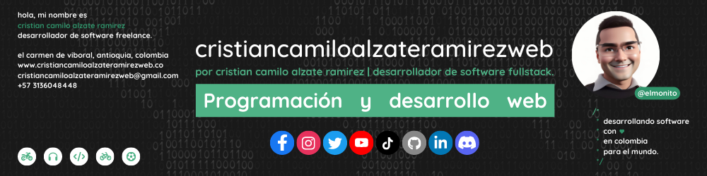

<h1>Hola, mi nombre es Cristian Camilo Alzate Ramirez </h1>

<h3>Desarrollador de software freelance</h3>

<strong><a href="https://cristiancamiloalzateramirezweb.co">cristiancamiloalzateramirezweb</a></strong> es el reflejo de mi sueño por crecer como profesional dentro del mundo del desarrollo de software. Me dedico a desarrollar páginas y aplicaciones web. Me apasiona la tecnología, la programación, el mundo del internet, crear cosas, aprender y enseñar a los demás. Me hace muy feliz lo que hago todos los días de mi vida.

Mi objetivo es aprender cada día más, brindar un excelente servicio para mis clientes e impactar de manera positiva compartiendo con ustedes un poco de mi experiencia generando herramientas como:

<a href="https://www.youtube.com/@cristiancamiloalzateramirezweb">📹Tutoriales</a>
<a href="https://cristiancamiloalzateramirezweb.co/blog">📖Articulos</a>
<a href="https://open.spotify.com/show/3xHFVNTx4ihEvGvqerclhM">🎙Podcast</a>
<a href="https://cristiancamiloalzateramirezweb.co/portafolio">💻Proyectos</a>

<h2>👨🏻‍💻 Sobre Mí</h2>

Hola, mi nombre es<strong> Cristian Camilo Alzate Ramirez, </strong>Nací hace 23 años en el Carmen de Viboral, Antioquía (Colombia). Soy un informático freelance emprendedor, autodidacta y apasionado por la tecnología, la programación y el mundo del Internet.

Desde 2020 que comence este camino, he trabajado para compañias como Selecta Colombia, Ikoniko 360 y trabajo como freelance en proyectos para clientes.
  
Si considera que tengo un sitio en tu equipo de trabajo o me quieres contar la idea para comenzar con el proyecto ¡Cuenta conmigo!
  
Es importante perseguir tus intereses y metas con pasíon, dedicación y determinación:

💻 Programar 🎧 Musica 📷 Fotos 📹 Videos ⚽ Futból 🚲 Bicicletas 🛵 Motos 🌄 Mochilear

<h2>Tecnólogias:</h2>

&nbsp;
&nbsp;
&nbsp;
&nbsp;
&nbsp;
&nbsp;
&nbsp;
&nbsp;
&nbsp;
&nbsp;

 
<h2>Encuéntrame en:</h2>

&nbsp;&nbsp;
&nbsp;&nbsp;
&nbsp;&nbsp;
&nbsp;&nbsp;
&nbsp;&nbsp;
&nbsp;&nbsp;
&nbsp;&nbsp;

