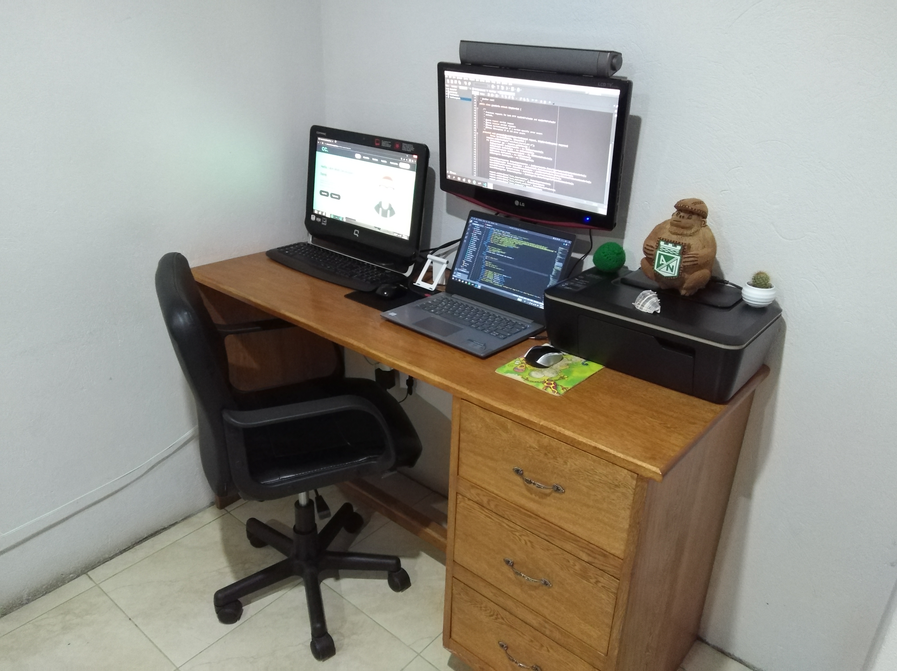

<h1>Hola, mi nombre es Cristian Camilo Alzate Ramirez. </h1>

<h4>Ingeniero freelance fullstack en desarrollo web</h4>

Soy tecnólogo en análisis y desarrollo de sistemas de información y dentro de poco sere ingeniero de sistemas profesional.

En el 2022, finalicé mi carrera y creé <strong><a href="https://cristiancamiloalzateramirezweb.co">cristiancamiloalzateramirezweb</a></strong>, un reflejo de mi sueño de crecer como profesional en el mundo del desarrollo de software. Desde entonces, me he dedicado a especializarme en el desarrollo de páginas y aplicaciones web, colaborando con dos empresas y fundando mi propia startup. La programación, la tecnología, la informática y el mundo de Internet me apasionan profundamente. Disfruto creando cosas nuevas, aprendiendo y compartiendo conocimientos con los demás. Cada día, dedicarme a estas actividades me brinda una gran felicidad y satisfacción en mi vida.

Mi objetivo es impactar de forma positiva tanto en clientes como en colegas, aportando mis habilidades y experiencias generando herramientas como:

<a href="https://www.youtube.com/@cristiancamiloalzateramirezweb">📹Tutoriales</a>&nbsp;
<a href="https://cristiancamiloalzateramirezweb.co/blog">📖Articulos</a>&nbsp;
<a href="https://open.spotify.com/show/3xHFVNTx4ihEvGvqerclhM">🎙Podcast</a>&nbsp;
<a href="https://cristiancamiloalzateramirezweb.co/portafolio">💻Proyectos</a>

<h2>Tecnólogias:</h2>

&nbsp;
&nbsp;
&nbsp;
&nbsp;
&nbsp;
&nbsp;
&nbsp;
&nbsp;
&nbsp;
&nbsp;
&nbsp;
&nbsp;

  
<h2>Encuéntrame en:</h2>

&nbsp;&nbsp;
&nbsp;&nbsp;
&nbsp;&nbsp;
&nbsp;&nbsp;
&nbsp;&nbsp;
&nbsp;&nbsp;
&nbsp;&nbsp;

